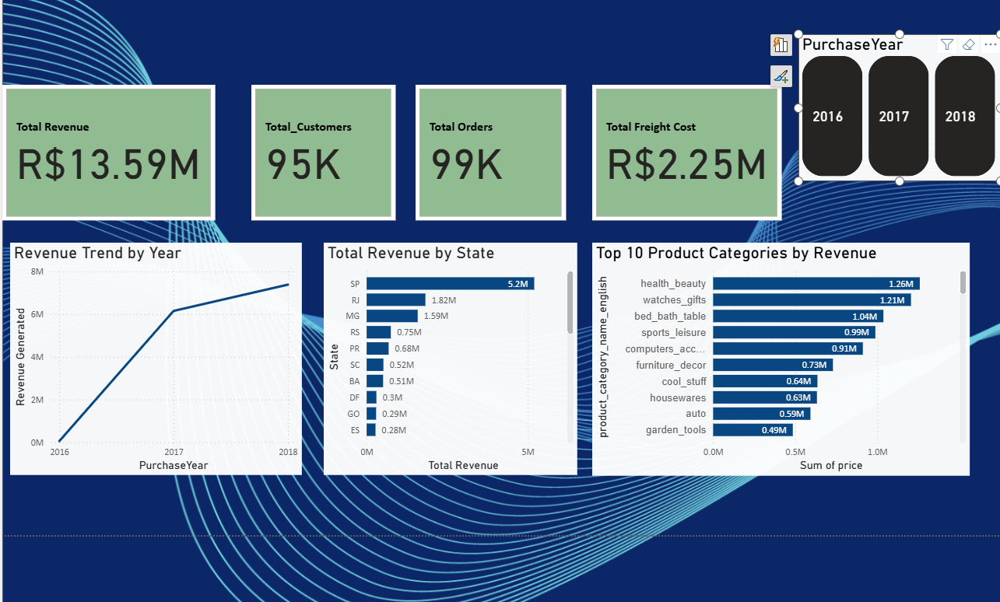
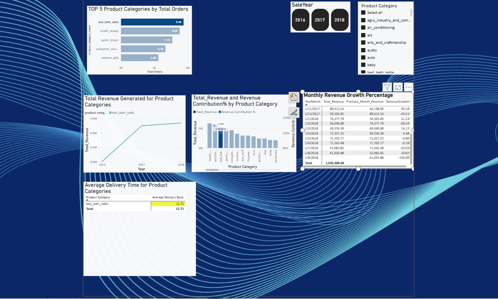
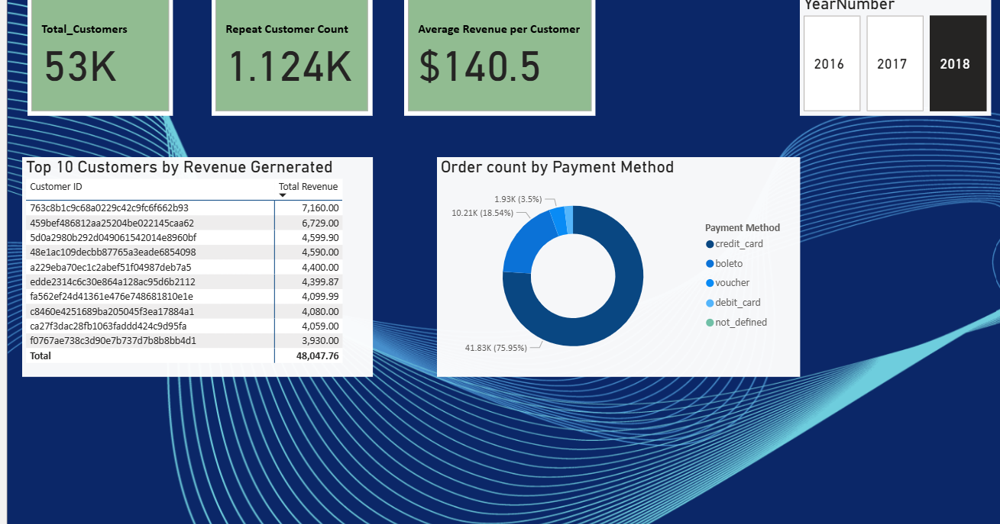

# 🛒 **Olist E-Commerce Data Analysis**

An end-to-end e-commerce data analytics project using the Olist Brazilian E-Commerce dataset. The project transforms raw CSV data into a validated and structured analytical model using Microsoft SQL Server, followed by interactive business reporting and analysis in Power BI.

The project focuses on sales performance, product categories, customer behavior, geographic performance, delivery metrics, and payment activity.


## 🎯 **Business Objectives**

The main objective of this project is to transform raw e-commerce data into a reliable analytical solution that can support business decision-making.

### Key Business Questions

-	What is the overall sales and order performance?

-	Which product categories generate the most revenue and orders?

-	How is revenue distributed across Brazilian states?

-	How does revenue change over time?

-	Which product categories have longer delivery times?

-	How much revenue does each product category contribute?

-	How many customers make repeat purchases?

-	Which customers generate the highest revenue?

-	How are orders distributed across payment methods?


## 🛠️ Tools & Technologies


| Tool / Technology | Purpose |
|---|---|
| Microsoft SQL Server | Data ingestion, cleansing, transformation, modeling and analysis |
| SQL | Data validation, business analysis and analytical queries |
| Power BI | Interactive dashboards and business reporting |
| DAX | Power BI measures and analytical calculations |
| Power Query | Data preparation within Power BI |
| GitHub | Version control and project documentation |


## 🗂️ Dataset


The project uses the Olist Brazilian E-Commerce dataset, consisting of multiple related datasets covering customers, orders, products, sellers, payments, reviews and Brazilian geographic information.

### Source Data

The datasets used in the project include:

-	Customers

-	Geolocation

-	Orders

-	Order Items

-	Order Payments

-	Products

-	Sellers

-	Reviews

-	Product Category Translation

The original CSV data was preserved in the SQL Server staging layer to maintain traceability throughout the transformation process.


## 🔄 Data Architecture

The project follows an end-to-end analytical pipeline:


```text

Olist CSV Files

      ↓

Raw / Staging Tables

      ↓

Data Quality Checks & Cleansing

      ↓

Dimensional Model

      ↓

Semantic Layer Views

      ↓

Power BI

      ↓

Interactive Business Reporting

```

This separates raw data ingestion, data-quality processing, analytical modeling, and reporting into distinct layers.


## 🧹 **SQL Server Data Pipeline & Modeling


### Raw / Staging Layer

The original Olist CSV files were loaded into SQL Server staging tables while preserving the source data.


### Staging Tables


- `Raw_Customer`

- `Raw_Geolocation`

- `Raw_Order_Items`

- `Raw_Order_Payments`

- `Raw_Orders`

- `raw_products`

- `Raw_Review`

- `raw_sellers`


## 🧹 **Data Quality & Cleansing

The staging data was profiled and validated before being used to build the analytical model.


### Key data-quality activities included:

-	City-name standardization

-	ZIP code, city and state mapping validation

-	Missing geography reference identification

-	Seller geography validation

-	Missing product-category handling

-	NULL and duplicate checks

-	Customer and seller key validation

-	Order and order-item relationship validation

-	Product-category availability validation

-	Payment and order-item amount reconciliation

A dedicated geography-cleaning process was used to standardize geographic information while keeping the original source data unchanged.


## 🏗️ Dimensional Model


The validated data was transformed into a dimensional model consisting of **2 fact tables and 6 dimension tables**.


### Fact Tables


| Table | Grain | Purpose |
|---|---|---|
| `Fact_Sales` | One row per order item | Sales and delivery analysis |
| `Fact_Payments` | One row per payment transaction | Payment analysis |


### Dimension Tables


| Table | Purpose |
|---|---|
| `Dim_Customer` | Customer and geographic analysis |
| `Dim_Geography` | Standardized geographic information |
| `dim_product_category` | Product categories and English translations |
| `Dim_Products` | Product attributes and categories |
| `Dim_Seller` | Seller and geographic analysis |
| `DimDate` | Time-based analysis |


`Fact_Sales` contains multiple date keys representing different order lifecycle events, including purchase, approval, carrier delivery, customer delivery, estimated delivery and shipping-limit dates.


### SQL Server Data Model


## 🧩 Semantic Layer

Business-friendly SQL Server views were created on top of the dimensional model to simplify Power BI reporting and ad-hoc analysis.


| View | Purpose |
|---|---|
| `VW_Sales_Analysis` | Detailed sales, customer, seller, product, geography and delivery analysis |
| `VW_Product_Performance` | Product-category performance, revenue, orders and delivery metrics |
| `view_Sales_KPI` | High-level sales KPIs |
| `VW_Product_Sales` | Product-level sales performance by category and purchase period |


The semantic layer provides a consistent analytical interface between the SQL Server model and Power BI.


## 📊 Power BI Dashboard

The SQL Server semantic layer was connected to Power BI to create an interactive three-page analytical report.

### 1. Executive Summary

Provides a high-level overview of business performance.


#### Key KPIs & Analysis

-	Total Revenue

-	Total Orders

-	Total Customers

-	Total Freight Cost

-	Revenue by State

-	Top 10 Product Categories by Revenue





### 2. Product Analysis

Focuses on product-category performance, revenue contribution, delivery performance and growth.


#### Key KPIs & Analysis

-	Top 5 Product Categories by Total Orders

-	Total Revenue by Product Category

-	Average Delivery Time by Product Category

-	Revenue and Revenue Contribution % by Product Category

-	Monthly Revenue Growth %

-	Sales Year filter

-	Product Category filter





### 3. Customer Analysis

Focuses on customer value, repeat purchasing behavior and payment activity.


#### Key KPIs & Analysis

-	Total Customers

-	Repeat Customer Count

-	Average Revenue per Customer

-	Top 10 Customers by Revenue

-	Order Count by Payment Method

-	Sales Year filter





## 🔑 Key Business Insights

The analysis identified several business patterns across sales, products, customers and geography.


This section will be updated with the quantified findings from the SQL analysis and Power BI report.


### 📈 Executive Summary


- The company generated **R$ 13.59M in total revenue** during the sales period from **September 2016 to September 2018**.

- The analysis covers approximately **95K customers** and **99K orders**.

- Total freight cost amounted to approximately **R$ 2.25M**.

- Revenue showed an **overall positive growth trend** during the analysis period.


### 🌎 Geographic Performance


- **São Paulo (SP)** generated the highest revenue at approximately **R$ 5.2M**, representing around **40% of total revenue**.

- **São Paulo (SP), Rio de Janeiro (RJ), and Minas Gerais (MG)** were the top three states by revenue generated.


### 🛍️ Product Performance


- The top three product categories by revenue were **`health_beauty`**, **`watches_gifts`**, and **`bed_bath_table`**.

- The top three product categories by order count were **`bed_bath_table`**, **`health_beauty`**, and **`sports_leisure`**.

- **`health_beauty`** contributed approximately **9.24% of total revenue**.


### 🚚 Delivery Performance


- **`office_furniture`**, **`christmas_supplies`**, **`fashion_shoes`**, and **`security_and_services`** recorded relatively longer average delivery periods.

- **`arts_and_craftmanship`** had the fastest average delivery time at approximately **5.6 days**.


### 💳 Payment Analysis


- **Credit cards** accounted for approximately **75% of purchase payments**.

- **Boleto** was the second-most-used payment method, accounting for approximately **18%** of purchase payments.


## 📁 Repository Structure


```text

olist-ecommerce-data-analytics/

│
├── README.md
│
├── data/
│   └── README.md
│
├── sql/
│   ├── 01_staging_tables.sql
│   ├── 02_data_quality_checks.sql
│   ├── 03_dimensions.sql
│   ├── 04_facts.sql
│   └── 05_semantic_layer_views.sql
│
├── powerbi/
│   └── OLIST_SALES_REPORT.pbix
│
├── screenshots/
│   ├── sql_server_data_model.png
│   ├── powerbi-executive-summary.png
│   ├── powerbi-product-analysis.png
│   ├── powerbi-customer-analysis.png
│   └── powerbi-data-model.png
│
└── documentation/
   ├── data_model.md
   └── data_quality.md

```


## 🚀 Project Workflow

The complete analytical workflow is:


```text

1. Load Olist CSV files into SQL Server

                        ↓

2. Preserve source data in staging tables

                        ↓

3. Perform data-quality checks and cleansing

                        ↓

4. Build dimensional model

                        ↓

5. Create semantic-layer views

                        ↓

6. Perform SQL business analysis

                        ↓

7. Connect SQL Server views to Power BI

                        ↓

8. Build interactive Power BI dashboards

                        ↓

9. Extract business insights

```


## 📌 Project Outcome


This project demonstrates an end-to-end data analytics workflow, combining:

-	Data ingestion

-	Data quality validation

-	SQL transformation

-	Dimensional modeling

-	Business-oriented SQL analysis

-	Semantic-layer development

-	Power BI dashboard development

-	Business insight generation


The final solution transforms raw e-commerce data into a structured analytical model and interactive reporting environment that supports analysis of sales, products, customers, geography, delivery performance and payment behavior.


## 👤 Author


**Chindu Francis**  

Data Analyst | SQL | Power BI | Data Analytics


[LinkedIn](https://www.linkedin.com/in/chindu-francis-45ba4380/) 


