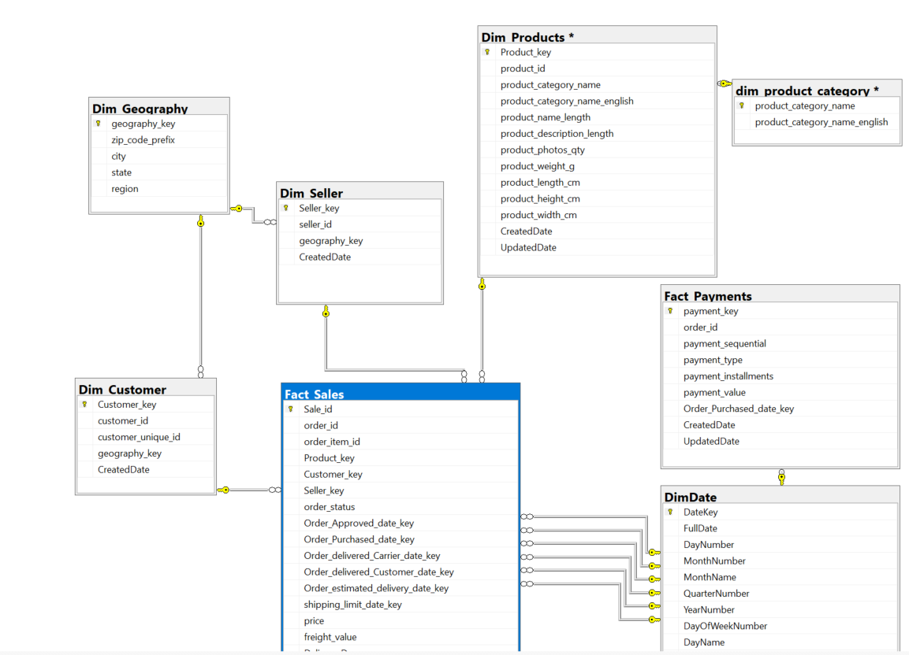

# Data Model

The validated and cleansed staging data was transformed into a dimensional model designed to support analytical reporting and Power BI.

The dimensional model separates transactional business events into fact tables and descriptive business attributes into dimension tables. This structure provides a reusable analytical foundation for reporting and ad-hoc analysis.


## Model Architecture


The overall data flow is:


```text

Olist CSV Files

      ↓

SQL Server Staging Tables

      ↓

Data Quality & Cleansing

      ↓

Fact & Dimension Tables

      ↓

Semantic Layer Views

      ↓

Power BI

```


## Fact Tables


### 1. `Fact_Sales`


Contains sales-related transactional data used for analyzing orders, products, sellers, customers, and sales performance.


Key analytical measures include:


- Order amount

- Item price

- Freight value

- Sales-related metrics

- Delivery measures

- Delivery days

- Delivery delay days


### 2. `Fact_Payments`


Contains payment-related transactional data used to analyze payment values and payment behavior.


Key analytical measures include:


- Payment value

- Payment installments


## Dimension Tables


### 1. `Dim_Customer`


Contains descriptive information about customers and supports customer-level analysis.


### 2. `Dim_Product`


Contains product attributes, including product category information, and supports product and category-level analysis.


### 3. `Dim_Seller`


Contains seller-related attributes and supports seller performance analysis.


### 4. `Dim_Geography`


Contains standardized geographic information used to analyze customers and sellers by location.


Geographic data was standardized during the staging process to address city-name inconsistencies and conflicting geographic mappings.


### 5. `Dim_Date`


Provides date attributes used for time-based analysis and reporting.


The date dimension supports analysis of sales, orders, and other business events over time.


## Modeling Approach


The dimensional model separates measurable business events from descriptive attributes.


The fact tables contain transactional measures, while the dimension tables provide the descriptive context required to analyze those measures.


The model supports analysis across the following dimensions:


- Customer

- Product

- Seller

- Geography

- Date


This structure allows business metrics to be analyzed across multiple dimensions while providing a consistent foundation for Power BI reporting.


## Data Quality Integration


The dimensional model was populated from validated and cleansed staging data rather than directly from the raw CSV files.


Examples of data quality handling incorporated into the model include:


- City-name standardization

- Conflicting ZIP code and state resolution

- Missing geography handling

- Missing product-category handling

- `UNDEFINED` product categories

- Unknown Geography members

- Key and duplicate validation

- Referential integrity checks


These controls help maintain consistency between fact and dimension tables.


## Data Model Diagram


The following diagram provides a visual representation of the dimensional model and its relationships.





## Semantic Layer


SQL Server views were created on top of the dimensional model to provide business-friendly datasets for Power BI.


The semantic layer abstracts underlying table and join complexity and provides a consistent interface for reporting and ad-hoc analysis.


```text

Fact & Dimension Tables

         ↓

Semantic Layer Views

         ↓

Power BI

```


## Purpose of the Model


The dimensional model was designed to:


- Support efficient analytical queries

- Provide consistent business dimensions for reporting

- Simplify Power BI data consumption

- Enable multi-dimensional analysis

- Separate data preparation from reporting logic

- Provide a reusable foundation for future analytical requirements


